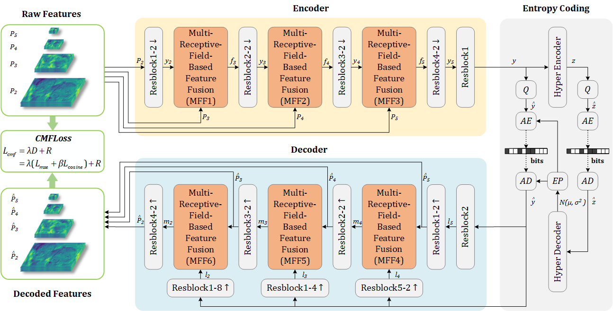

# MCNN
Multi-scale feature compression is essential in machine vision tasks for reducing storage and transmission costs while maintaining task performance. However, existing multi scale feature compression methods fail to effectively extract and aggregate the local and global correlations of multi-scale features, resulting in incomplete elimination of feature redundancies. Moreover, these multi-scale feature compression methods mainly rely on mean square error-based loss functions to optimize signal f idelity, but they fail to adequately preserve semantic information critical to machine vision tasks. To address these issues, a Multi receptive-field Convolutional Neural Network (MCNN)-based multi-scale feature compression method is proposed in this paper, which not only achieves compact fusion of multi-scale features but also enhances the semantic fidelity of reconstructed features. To effectively eliminate feature redundancies, a multi-receptive field-based feature fusion module is designed for capturing both local and global correlations in multi-scale features. To enhance the quality of the reconstructed features, a cosine similarity based multi-fidelity loss function is developed by considering both signal and semantic fidelity. 


### Dataset
| Dataset   | Links                                                       |
| --------- | ----------------------------------------------------------- |
| OpenimagesV6      | https://storage.googleapis.com/openimages/web/download.html      |


### Training and Testing
```bash
CUDA_VISIBLE_DEVICES=0 python train.py --task detection --quality 4
```
- The task is selected as detection or segmentation, and the quality is selected from 1 to 4.


## Requirements
- PyTorch=1.12.1
- Torchvision=0.17.2
- numpy=1.23.5
- detectron2=0.6
- compressai=1.2.4
